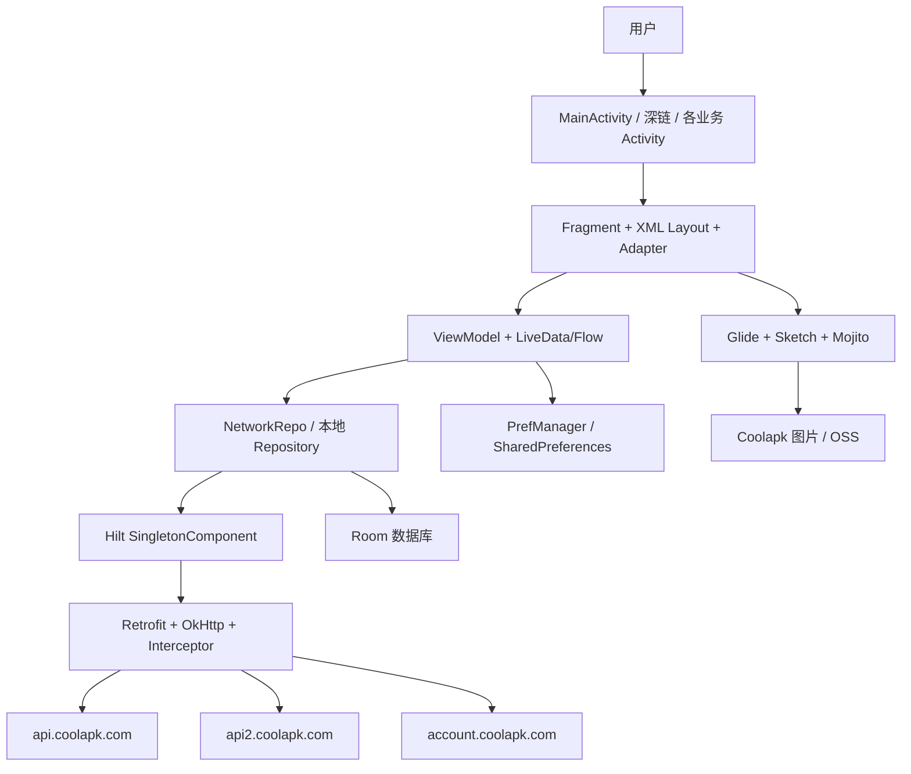

# 系统架构

## 1. 总览

`c001apk` 是一个传统 Android 多模块应用。`app` 是可运行的主应用，三个本地 library module 负责图片预览及图片加载适配。主应用没有独立 Domain 层或 Compose UI，核心调用关系是：



从源码角度，生产主链路是：

```text
Activity/Fragment
  -> ViewModel
  -> logic.repository.NetworkRepo
  -> Hilt 注入的 ApiService
  -> Retrofit Call.await()
  -> Flow<Result<T>>
  -> ViewModel 更新 LiveData
  -> Fragment/Adapter 渲染
```

本地读写则是：

```text
Fragment/ViewModel
  -> HistoryFavoriteRepo / HomeMenuRepo / SearchHistoryRepo /
     RecentAtUserRepo / RecentEmojiRepo / BlackListRepo
  -> DAO
  -> 独立 Room 数据库
```

## 2. Gradle 模块

| 模块 | 类型 | 职责 | 主应用依赖 |
|---|---|---|---|
| `app` | Android application | 页面、网络、状态、本地数据、资源、Manifest 和 APK | 根模块 |
| `mojito` | Android library | 图片预览 Activity、Fragment、手势、转场、加载协议 | `app`、两个 loader |
| `GlideImageLoader` | Android library | 将 Glide/OkHttp 接入 Mojito 的 `ImageLoader` | `app` 间接使用 |
| `SketchImageViewLoader` | Android library | 将 Sketch/GIF/分块图片能力接入 Mojito | `app` 间接使用 |

这三个 library 的包名仍使用 `net.mikaelzero.mojito` 命名空间，属于项目内集成的图片库代码，不应误认成业务模块。

## 3. `app` 内部边界

### 3.1 启动与应用级能力

- `MyApplication` 使用 `@HiltAndroidApp` 建立依赖注入入口。
- 启动时读取 `PrefManager.darkTheme`，初始化深色模式。
- 初始化 Mojito，组合 `GlideImageLoader` 和 `SketchImageLoadFactory`。
- 注册全局未捕获异常处理器，异常时启动 `BugHandlerActivity` 并结束当前进程。
- `ActivityCollector` 用于重建或管理部分 Activity。

### 3.2 UI 层

`ui/` 以业务功能分目录，主要边界如下：

| 包 | 主要职责 |
|---|---|
| `ui/main` | 三段式主导航、消息角标、初始化账号/应用信息 |
| `ui/home`、`ui/homefeed` | 首页 Tab、关注/头条/热榜/酷图 feed |
| `ui/applist`、`ui/app`、`ui/appupdate` | 应用列表、应用详情、更新检查 |
| `ui/feed` | 动态详情、评论分页、投票、问答、分享和回复入口 |
| `ui/feed/reply` | 回复编辑、@用户/@话题、表情、验证码和图片上传 |
| `ui/topic`、`ui/hometopic` | 话题/数码页面及其内容列表 |
| `ui/user`、`ui/follow` | 用户主页、动态、关注、粉丝和相关列表 |
| `ui/search` | 搜索入口、历史、类型/排序和结果页 |
| `ui/message`、`ui/messagedetail` | 消息汇总、通知、@我、点赞、关注等详情 |
| `ui/login` | 账号密码登录、验证码、Cookie 和登录状态回写 |
| `ui/history`、`ui/collection`、`ui/blacklist` | 本地历史/收藏和黑名单管理 |
| `ui/settings`、`ui/settings/params` | 外观、显示、设备/请求参数和缓存设置 |
| `ui/others` | WebView、外链、复制、关于和崩溃处理 |

`BaseActivity`、`BaseFragment`、`BaseViewModel`、`BaseAppViewModel` 提供通用绑定、列表状态、分页字段、统一交互和基础社交操作。具体业务 ViewModel 仍保留较多页面级状态和请求处理，因此当前不是严格的 Clean Architecture。

### 3.3 列表和渲染

- 列表多使用 RecyclerView、ConcatAdapter、ViewBinding/Data Binding。
- `adapter/ViewBindingAdapters.kt` 负责图片、富文本、关注状态、点赞状态、关系卡片和评论行等绑定。
- `LinkTextView`、`SpannableStringBuilderUtil` 和 `MyURLSpan` 将 HTML/链接/表情转换为可点击文本。
- `NineGridImageView` 处理多图布局，并把点击交给 Mojito 全屏预览。
- 加载状态由 `LoadingState`、`FooterState` 和通用占位布局表达。

## 4. 网络架构

### 4.1 当前主路径

`di/NetworkModule.kt` 注册四个带 Qualifier 的 Retrofit 服务：

| Qualifier | Base URL | OkHttp 行为 | 用途 |
|---|---|---|---|
| `@Api1Service` | `https://api.coolapk.com/` | `AddCookiesInterceptor`，跟随重定向 | 大多数业务 API |
| `@Api1ServiceNoRedirect` | `https://api.coolapk.com/` | `AddCookiesInterceptor`，不跟随重定向 | 获取应用下载 `Location` |
| `@Api2Service` | `https://api2.coolapk.com/` | 复用 API1 请求头客户端 | 首页、动态详情/回复和部分用户接口 |
| `@AccountService` | `https://account.coolapk.com/` | `LoginCookiesInterceptor` | 登录参数、验证码和账号页请求 |

`NetworkRepo` 将 Retrofit 的 `Call<T>` 通过 `suspendCoroutine` 转为挂起调用，再用 `flow {}` 捕获异常并返回单次 `Flow<Result<T>>`。ViewModel 通常在 `Dispatchers.IO` 启动收集，成功后更新 LiveData，失败则显示页面错误或打印堆栈。

> R-013 已将两套网络配置改为复用 `NetworkEndpoints`，三组 Base URL 统一以 `/` 结尾；构建、单元测试和依赖网络注入的 Activity 启动仍待当前工具链验证。

### 4.2 请求身份与状态

`AddCookiesInterceptor` 会根据 `PrefManager` 和 `CookieUtil` 注入：

- `User-Agent`、`X-App-Id`、`X-App-Version`、`X-App-Code`、`X-Api-Version`。
- `X-App-Device`、由设备码和时间计算的 `X-App-Token`。
- locale、channel、mode、dark mode 等请求头。
- 登录态下的 `uid/username/token` Cookie；未登录时使用会话 Cookie。

`LoginCookiesInterceptor` 依赖 `CookieUtil` 中的一组一次性 flag，按登录步骤切换浏览器风格 Header、Referer、Origin 和会话 Cookie。这是有顺序的状态机，不应并发复用同一组 flag。

### 4.3 错误和分页模型

- `NetworkRepo` 将网络异常和空响应体转为 `Result.failure`。
- HTTP 非 2xx 是否被视为业务错误，取决于 Retrofit `Response` 是否直接返回给调用者；当前没有统一的错误码映射层。
- feed、评论、搜索、消息等接口普遍使用 `page`、`firstItem`、`lastItem` 或 `pageType/pageParam` 进行分页。
- ViewModel 自己维护 `isRefreshing`、`isLoadMore`、`isEnd`、`lastItem` 和 `FooterState`，页面之间没有统一分页组件。

### 4.4 历史网络层

`logic/network/ApiServiceCreator.kt`、`logic/network/Network.kt` 和 `logic/network/Repository.kt` 还保留一套手工创建 Retrofit、再包装成 LiveData/Flow 的实现。静态搜索显示当前 UI ViewModel 引用的是 `logic/repository/NetworkRepo.kt`，未发现业务代码调用旧 `Repository`；因此它目前是遗留/备用链路，存在接口和 Header 配置漂移风险。本次文档任务不删除它，后续应先确认没有外部使用者，再统一或移除。

## 5. 本地存储

### 5.1 SharedPreferences

`PrefManager` 使用名为 `settings` 的普通 `SharedPreferences`，保存：

- 主题、主题色、纯黑模式、系统取色、字体比例、图片质量、表情显示。
- 登录开关、UID、用户名、Token、头像、等级和经验。
- Coolapk 版本/API 版本、设备制造商/品牌/型号/Build、SDK、Android 版本、User-Agent。
- `SZLMID`、`xAppDevice`、`xAppToken`、自定义 Token 开关和首页/历史/外部浏览器等偏好。

这些值会影响请求身份和页面行为；清除应用数据会同时清除登录摘要和设备参数。当前未见加密存储。

### 5.2 Room 数据库

每类数据使用独立数据库和 Qualifier，便于不同 Repository 注入：

| 数据库文件 | Entity | 用途 | 版本 |
|---|---|---|---:|
| `browse_history.db` | `FeedEntity` | 浏览历史 | 1 |
| `feed_favorite.db` | `FeedEntity` | 本地动态收藏 | 2 |
| `home_menu.db` | `HomeMenu` | 首页 Tab 顺序和启用状态 | 5 |
| `recent_at_user.db` | `RecentAtUser` | 最近 @用户 | 2 |
| `recent_emoji.db` | `StringEntity` | 最近使用表情 | 2 |
| `search_history.db` | `StringEntity` | 搜索历史 | 2 |
| `topic_blacklist.db` | `StringEntity` | 话题黑名单 | 2 |
| `user_blacklist.db` | `StringEntity` | 用户黑名单 | 2 |

`DatabaseModule` 注册了多条迁移。新增字段或改变主键时必须同时更新 Entity、数据库版本、Migration 和 `schemas/` 生成结果，并在旧数据库上实测升级。

### 5.3 图片和文件

- Glide 负责常规图片加载和缓存。
- Sketch loader 支持 Mojito 所需的部分大图/GIF/分块能力。
- Mojito 负责图片全屏预览、缩放、切换、保存和分享回调。
- `FileProvider` 只暴露 `external-cache/imageShare/` 路径用于分享。
- WebView 下载使用 Android `DownloadManager`，目标目录为公共 Downloads。
- 应用缓存可由设置页清理；Room 数据库不属于该缓存清理范围。

## 6. 导航、深链和 WebView

### 6.1 主导航

`MainActivity` 使用不可左右滑动的 `ViewPager2` 承载 `HomeFragment`、`MessageFragment` 和 `SettingsFragment`，底部导航切换页面。首页内部再使用可配置的 Tab/ViewPager2。

### 6.2 外链路由

`NetWorkUtil.openLink` 会先把 `coolmarket://`、`coolapk1s.com`、HTTP/HTTPS 和 `www.` 等形式规范化，再按路径映射到：

| 链接形态 | 页面 |
|---|---|
| `/feed/<id>`、`/picture/<id>` | `FeedActivity` |
| `#/feed/...`、`#/page?url=...` | `CarouselActivity` |
| `/apk/...`、`/game/...` | `AppActivity` |
| `/u/...` | `UserActivity` |
| `/t/...` | `TopicActivity` 或 `CoolPicActivity` |
| `/product/...` | `TopicActivity`（product 模式） |
| 普通 HTTP/HTTPS | `WebViewActivity` 或外部浏览器 |
| 不支持的 Scheme | Toast + 复制链接 |

`AppLinkActivity` 是 Manifest 中唯一面向外部的深链 Activity，接收自定义 `coolmarket` 和 Coolapk HTTP/HTTPS 链接后转交上述路由，再结束自身。实际深链匹配必须在设备上用 `adb shell am start` 和浏览器点击分别验证。

### 6.3 WebView

`WebViewActivity` 位于 `:webview` 独立进程，启用 JavaScript、DOM Storage、文件访问和网页下载能力，并向 `m.coolapk.com` 写入当前账号 Cookie。它还处理 `intent://`、自定义 Scheme 和网页内下载确认。该页面可接触登录态，外链、Cookie 隔离、下载文件名和返回栈都属于高风险验收项。

## 7. 构建与发布架构

- 根 `settings.gradle.kts` 包含四个模块，并限制仓库来源为 Google、Maven Central、JitPack、Sonatype 和 Gradle Plugin Portal。
- `gradle/libs.versions.toml` 集中维护依赖版本。
- `app` 使用 ViewBinding、Data Binding、BuildConfig、Hilt KSP、Room KSP、Glide KSP。
- Release 开启 `isMinifyEnabled` 和 `isShrinkResources`。
- GitHub Actions 使用 JDK 17，先验证 Wrapper，然后构建 Release/Debug 并上传 APK 与 Release mapping；当前 workflow 没有测试、lint 或设备验收步骤。

## 8. 安全、隐私和兼容性风险

1. 登录 Cookie、Token、设备码和 User-Agent 进入请求 Header，并且部分值由普通 `SharedPreferences` 保存。
2. 显式开启 Debug BODY 日志时仍可能接触账号请求或服务端响应，当前实现会对常见 Cookie、Token、密码、验证码和 STS 字段脱敏。
3. 明文流量开关已关闭；应用控制的 HTTP 初始链接、跳转、下载和外部打开路径会先升级为 HTTPS。
4. `QUERY_ALL_PACKAGES` 会读取已安装应用列表，因应用列表和更新检查功能仍保留；未发现应用内安装调用，`REQUEST_INSTALL_PACKAGES` 已移除。
5. 设备码和 Coolapk 版本参数可在设置中修改，改变后可能导致接口拒绝、账号风控或数据错配。
6. API、登录流程、图片地址、OSS 回调和返回字段依赖第三方服务，必须把线上验证与编译验证分开记录。
7. 当前测试不能覆盖 Room 迁移、Token 生成、深链、WebView、图片保存、分页边界和发布签名。

## 9. 维护规则

- 新页面优先沿用现有 XML + ViewBinding/Data Binding、ViewModel 和 `NetworkRepo` 结构，不再新增第三套网络封装。
- 修改请求 Header、登录状态、分页参数、API 路由或数据库迁移时，必须同步更新 [`docs/api.md`](api.md)、本文件和 [`docs/todo.md`](todo.md)。
- 不在源码、文档、截图或提交信息中写入真实密码、Cookie、Token、STS 凭据和签名密码。
- 任何“已实现”结论都要标注证据层级：源码存在、构建通过、模拟器验证、真实设备验证或真实接口验证。
- 对外发布前必须复核许可证、官方服务条款、权限必要性、日志等级、签名配置和隐私披露。
